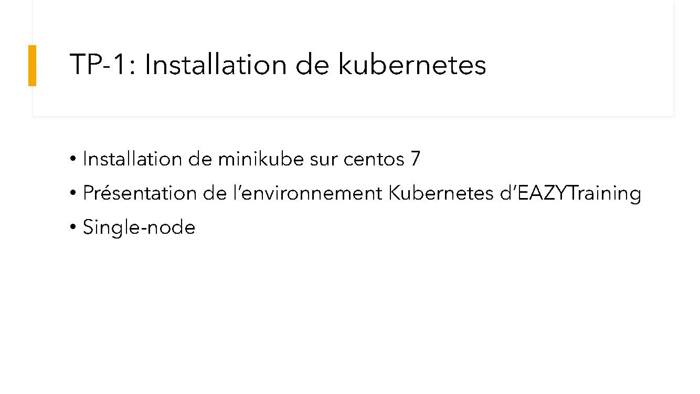
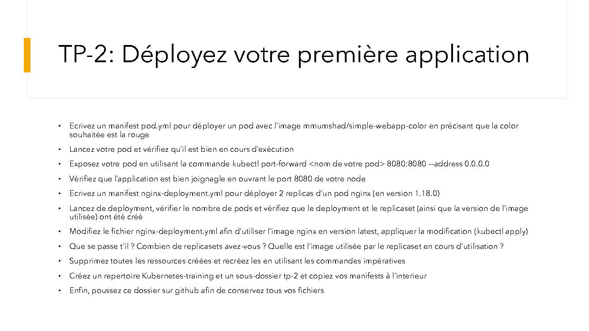
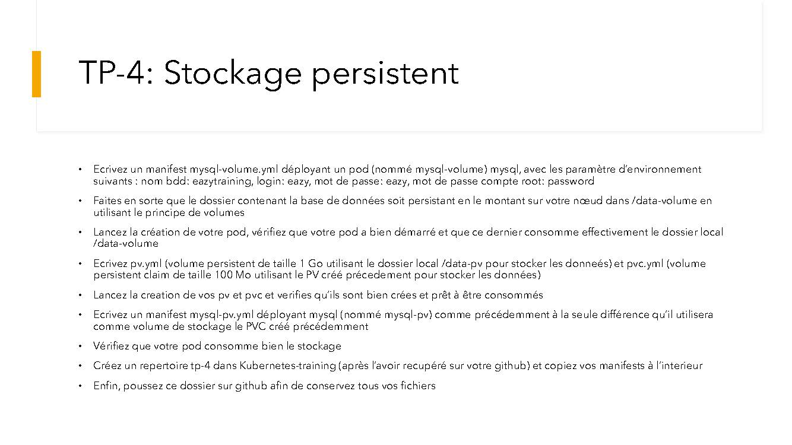
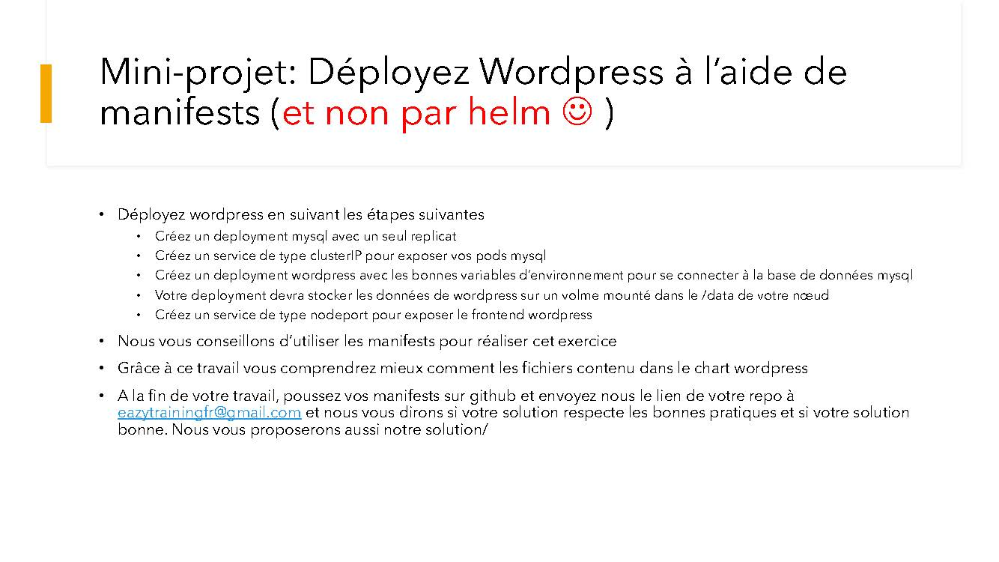

# KUBERNETES-TRAINING
Ce projet contient un ensemble de TPs dont les codes sources sont disponibles dans chacun des répertoires.
- Le fichier Readme de chaque LAB décrit le sénario réalisé.
- Dans les fichiers Readme.md, sont également données des indications pour la compréhension de chacun des TPs

# Infos sur le réalisateur du projet
Session       : Bootcamp DevOps N°15 de Eazytraining

Nom & Prénoms : GBENOU Kossi

LinkedIn      : https://www.linkedin.com/in/gkossi/

# Les Technos utilisées :

 

 

## TP1: Installation de k8s
> ![TP1-Installation de k8s] 

## TP2: Déployez votre 1ère application
> ![TP2-Déployez votre 1ère application] 

## TP3: Créez un service de type nodeport
> ![TP3-Créez un service de type nodeport] 

## TP4: Stockage persistent
> ![TP4-Stockage persistent] 

## TP5: Déployez Wordpress
> ![TP5-Déployez Wordpress] 

## Mini-projet: Déployez Wordpress à l'aide de manifests
> ![Mini-projet-Déployez Wordpress à l'aide de manifests] 