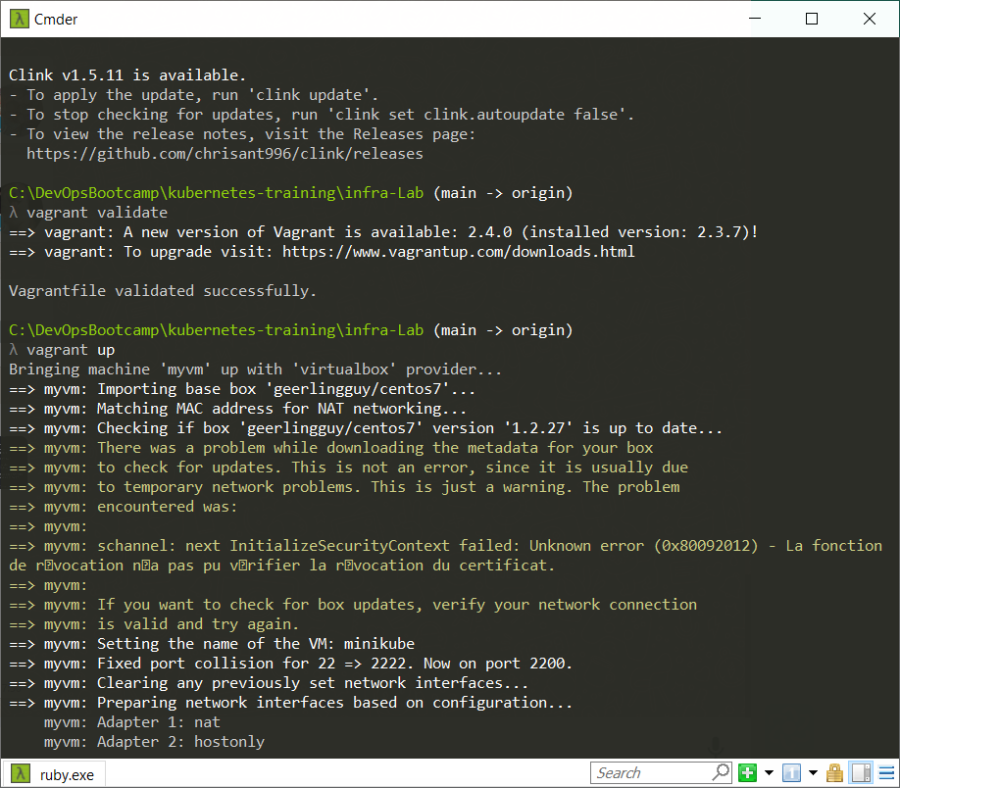
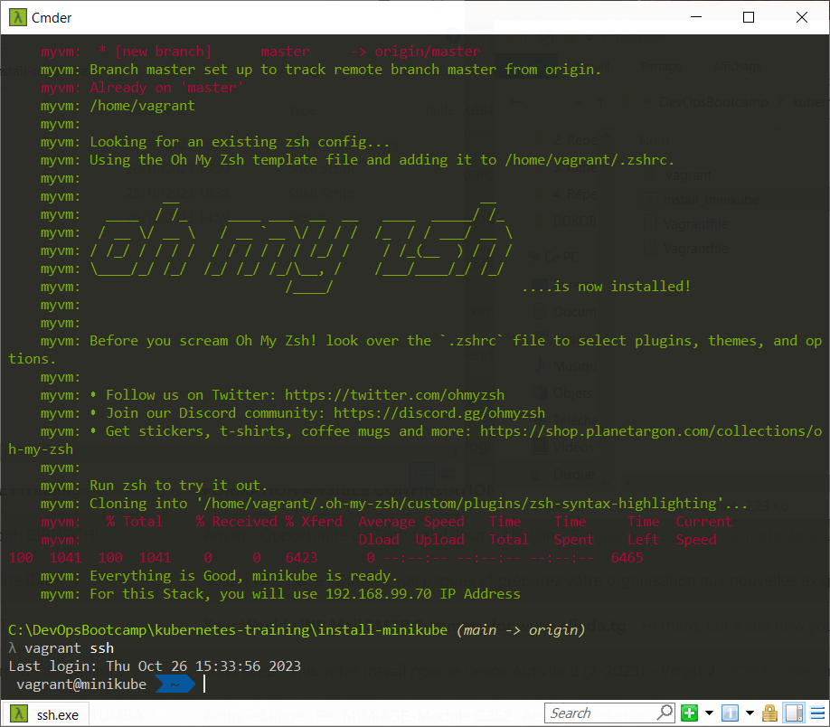
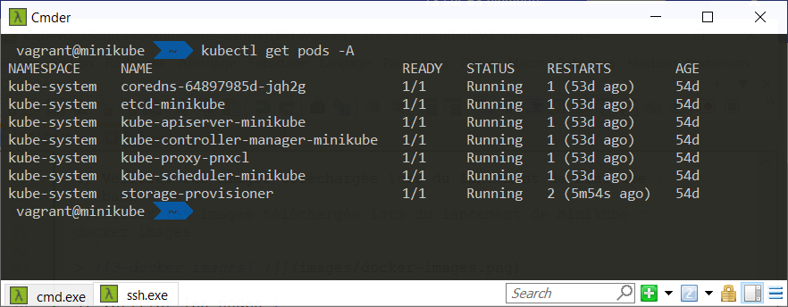

# Infos sur le réalisateur du projet
Session       : Bootcamp DevOps N°15 chez Eazytraining

Nom & Prénoms : GBENOU Kossi

LinkedIn      : https://www.linkedin.com/in/gkossi/

# TP N°1 : MISE EN PLACE DE L'INFRA

Dans ce TP N°1, il est question de mettre en place une infrastructure basée sur Minikube (1 Master et 1 Worker) qui va servir de plateforme d'exploitation de Kubernetes.

NB: l'objectif est d'avoir une VM qui va renfermer les composants à la fois d'un Master et d'un Worker. On va donc créer à base de docker, les composants de kubernete (kube-apiserver, ETCD, kube-scheduler, kube-controler-manager, kubelet, kube-proxy et container runtine engine(docker)) sous forme de conteneurs à utiliser dans notre machine virtuelle 

#On va installer les outils nécessaires et démarrer minikube à partir de son fichier exécutable qui va se charger de télécharger les images pour créer les conteneurs nécessaires tel que : kube-apiserver, etcd, kube-scheduler, kube-controller-manager, kubelet, kube-proxy, coredns, kubectl, storage-provisioner

# Les Technos utilisées :

<div align="center">

<!--img src="https://github.com/Tony-Dja/Jenkins_pipeline_HEROKU_deployment/blob/672b58d62fa5d424fb7162e33546c67f3bcbebc2/screenshots/jenkins.png" width="50%" height="50%"-->


<a href="https://git-scm.com/" target="_blank">
	
</a>
<a href="https://www.docker.com/" target="_blank">
	
</a>
<a href="https://kubernetes.io" target="_blank">
	
</a>
 
<a href="https://www.gnu.org/software/bash/" target="_blank"> 
	  
</a>
</div>

<br />
<div align="center">


</div>

- VirtualBox : est un hyperviseur de type 2 qui va servir de provisioner à utiliser pour créer une VM
- Vagrant : c'est un gestionnaire d'infrastructure as Code qui va servir à configurer notre infra sous forme de code
- Vagrantfile: ce fichier contient tous les paramètres utilisés pour créer la machine virtuelle
- install-minikube.sh: ce fichier contient le script d'installation de Docker et de Docker-compose
- Git     : pour versionner le code source
- Docker  : pour conteneuriser les applications afin d'utiliser les concepts de microservices
- Minikube: pour la mise en place d'un cluster Kubernetes (1 Master et 1 Worker)
- Kubectl : la ligne de commande pour exploiter Kubernetes à partir de Minikube


# Les fichiers utilisés et leur role :
- Vagrantfile: ce fichier contient tous les paramètres utilisés pour créer la machine virtuelle
- install_minikube.sh: ce fichier contient le script d'installation de tous outils nécessaires étape par étape tel que : les pré-requis, Docker, Minikube, Kubectl


## Step N°1 : Provisionement de la VM à partir de Vagrant

1) Entrer dans le répertoire d'installation et lancer le provisionement :
```bash
#Entrer dans le répertoire d'installation
cd ./install-minikube

#Lancer le provisionement de la VM à partir de Vagrant
vagrant up
```
> ![1-vagrant up] 

2) Se connecter à la VM en ssh :
```bash
#Se connecter à la VM en ssh
vagrant ssh
```
> ![2-vagrant ssh] 

3) Vérifier les images téléchargée lors du lancement de minikube :
```bash
#Vérifier les images téléchargée lors du lancement de minikube :
docker images
```
> ![3-docker images] 

4) Vérifier les nodes :
```bash
#Vérifier les nodes :
kubectl get nodes
```
> ![4-kubectl-get-nodes] 

5) Vérifier les pods :
```bash
#Vérifier les pods :
kubectl get pods -A
```
> ![5-kubectl-get-pods] 
