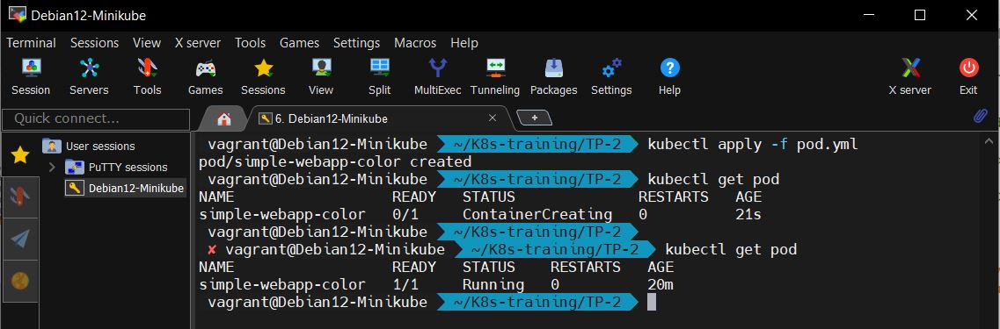

# Infos sur le réalisateur du projet
Session       : Bootcamp DevOps N°15 chez Eazytraining

Nom & Prénoms : GBENOU Kossi

LinkedIn      : https://www.linkedin.com/in/gkossi/

# TP N°2 : DÉPLOYEZ VOTRE PREMIÈRE APPLICATION

• Ecrivez un manifest pod.yml pour déployer un pod avec l’image *mmumshad/simple-webapp-color* en précisant que la color souhaitée est la rouge

• Lancez votre pod et vérifiez qu’il est bien en cours d’exécution

• Exposez votre pod en utilisant la commande kubectl port forward <nom de votre pod > 8080:8080 address 0.0.0.0

• Vérifiez que l’application est bien joignagle en ouvrant le port 8080 de votre node

• Ecrivez un manifest nginx deployment.yml pour déployer 2 replicas d’un pod nginx (en version

• Lancez de deployment , vérifier le nombre de pods et vérifiez que le deployment et le replicaset (ainsi que la version de l’image utilisée) ont été créé

• Modifiez le fichier nginx deployment.yml afin d’utiliser l’image nginx en version latest , appliquer la modification kubectl apply

• Que se passe t’il ? Combien de replicasets avez vous ? Quelle est l’image utilisée par le replicaset en cours d’utilisation ?

• Supprimez toutes les ressources créées et recréez les en utilisant les commandes impératives

• Créez un repertoire Kubernetes training et un sous dossier tp 2 et copiez vos manifests à l’interieur

• Enfin , poussez ce dossier sur github afin de conservez tous vos fichiers


# REALISATIONS ETAPE PAR ETAPE :

## Task N°1: Ecrivez un manifest pod.yml pour déployer un pod avec l’image *mmumshad/simple-webapp-color* en précisant que la color souhaitée est la rouge

Pour se faire, on cré le fichier pod.yml et on y ajoute le code suivant :
```bash
apiVersion: v1
kind: Pod
metadata:
  name: simple-webapp-color
  labels:
    app: webapp
spec:
  containers:
    - name: webapp
      image: mmumshad/simple-webapp-color
      ports:
        - containerPort: 8080
      env:
        - name: APP_COLOR
          value: red
```

## Task N°2: Lancez votre pod et vérifiez qu’il est bien en cours d’exécution

Pour se faire, on va exécter les 2 commandes suivantes :
```bash
kubectl apply -f pod.yml
kubectl get pod
```
> ![1-Pod: création et exécution] 

## Task N°3:
2) Se connecter à la VM en ssh :
```bash

```

> ![2-vagrant ssh] 

## Task N°4:
3) Vérifier les images téléchargée lors du lancement de minikube :
```bash
#Vérifier les images téléchargée lors du lancement de minikube :
docker images
```
> ![3-docker images] 

## Task N°5:
4) Vérifier les nodes :
```bash
#Vérifier les nodes :
kubectl get nodes
```
> ![4-kubectl-get-nodes] 

## Task N°6:
5) Vérifier les pods :
```bash
#Vérifier les pods :
kubectl get pods -A
```
> ![5-kubectl-get-pods] 

## Task N°7:

```bash

```
> ![5-kubectl-get-pods] 

## Task N°8:

```bash

```
> ![5-kubectl-get-pods] 

## Task N°9:

```bash

```
> ![5-kubectl-get-pods] 

## Task N°10:

```bash

```
> ![5-kubectl-get-pods] 